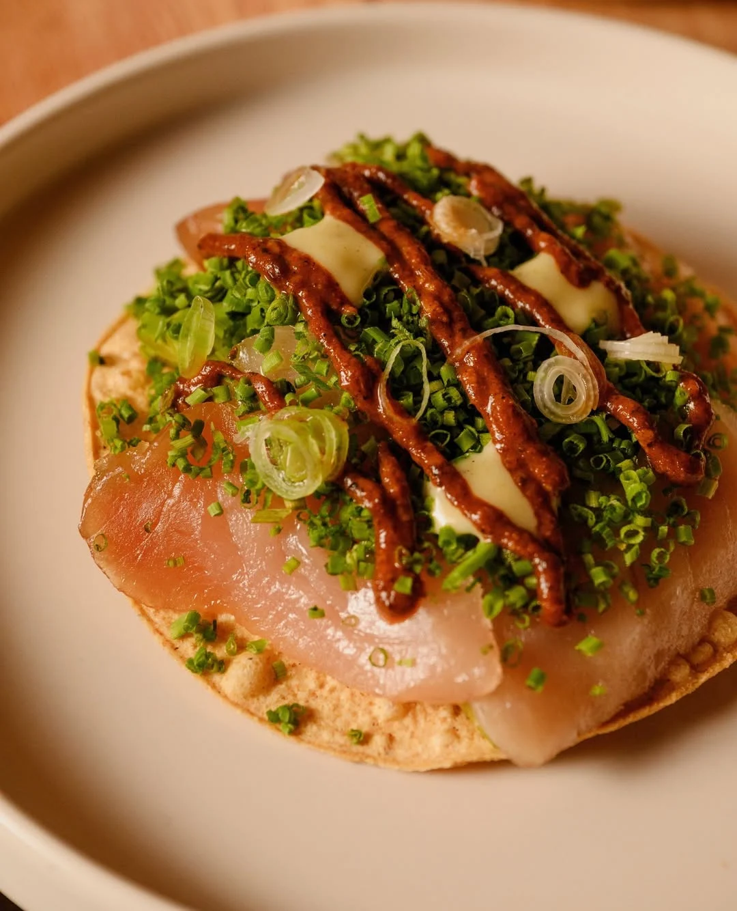
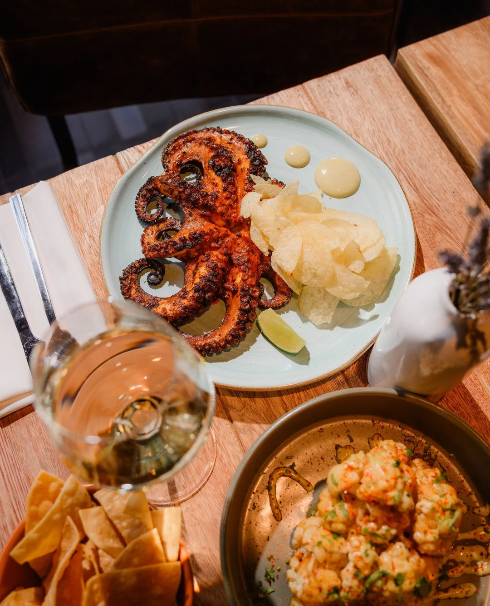
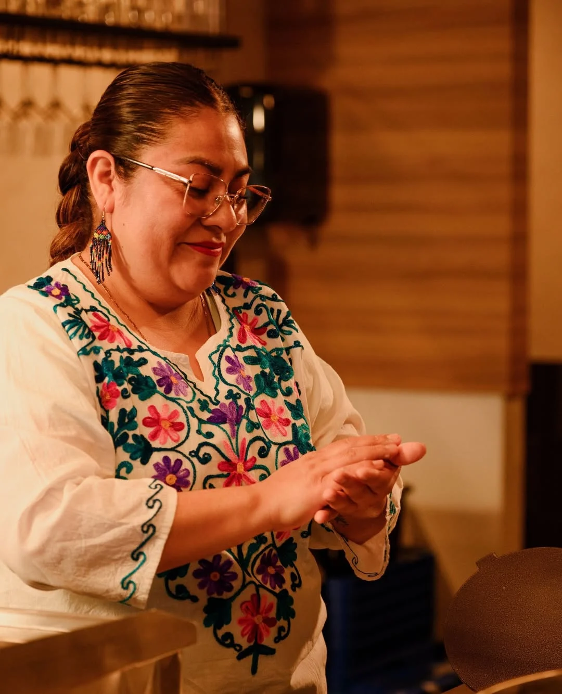
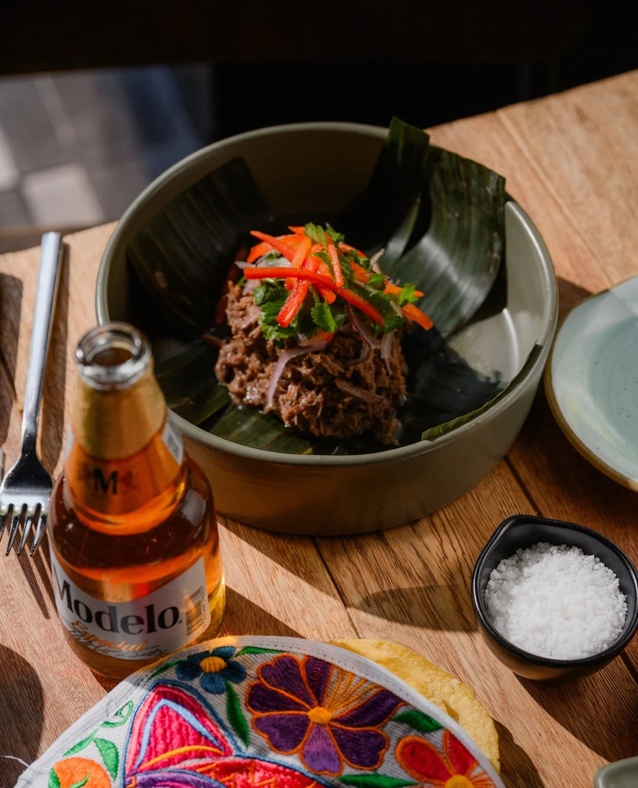
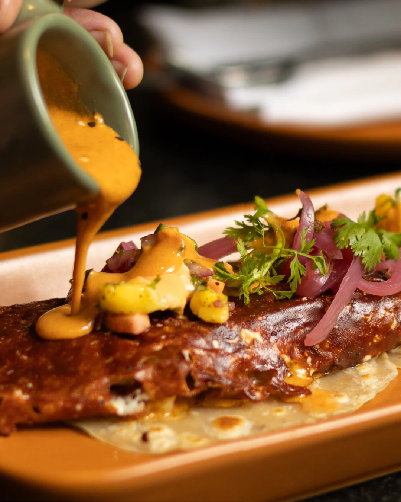

Acuyo is a leaf.

It's big and shaped like a heart, and it grows where Mexico is hot and wet. Crush one and you get anise, a little black pepper, and something startlingly close to root beer. Cooks wrap fish in it. They steam tamales inside it. They chop it into green mole, where it stops being a herb and becomes most of the point.

The word is Nahuatl. In Veracruz and Tabasco, the leaf is acuyo. Cross a few states and the same plant answers to hoja santa, or to momo, or to a Mayan name I can't say out loud. One leaf, a different word depending on where you're standing.

## Where they're standing is Guadalajara

The four owners are all from there. Guadalajara sits in Jalisco, on the Pacific side. Veracruz is on the Gulf, most of the way across the country. They opened on Alberni Street in downtown Vancouver, and they put the far word over the door.

Their own explanation, in the opening announcement, is that the leaf stands for "diversity, freshness, and the very roots of Mexico." That's press-release language and I'd rather hear it from one of them at the bar. But look at how the kitchen is set up and the choice reads differently. The menu moves to a different region of Mexico every month. A Jalisco name would have promised Jalisco food. A leaf with four names promises something wider.

## What's on the plate

Fire, mostly. The octopus and the cod come *zarandeado*, a method from Nayarit: split the thing open, rub it with chile, put it straight over the flame. The head chef, Rafael Chavez, says the restaurant is built around *calor*. The word means heat. It also means warmth.

Away from the fire, there's duck confit under pipián, a sauce ground from pumpkin seeds, and a taco gobernador packed with shrimp and melted cheese. And somebody presses the tortillas by hand, in the room, while you're sitting in it.

That last one is worth stopping on. Alberni is the block with the luxury shops, where the rent is nobody's secret. Pressing tortillas by hand in a room like that is slow work, and nobody would notice if they quietly stopped.

Four months in, no Vancouver critic has written about the food. Everything published so far has repeated that one line about the leaf and moved on. Which means if you go now you get to make up your own mind, and that is rarer than it should be.

I should say plainly that I haven't been. This magazine is published by Bravo, a Vancouver app for finding restaurants and eating with other people. Acuyo joined it in April, which is how it got onto my list in the first place. Nobody here has sat down at one of those tables yet. What I'd order when I do is the octopus, because fire is the thing this kitchen keeps coming back to.

## The question I'd ask

Not why Mexican food. Not why Alberni Street. Just: why that leaf?

Above the bar there's a grid of lit wooden boxes, and inside nearly every one is the same shape, cut dark against the light. The leaf, over and over, the length of the room. Whoever chose it thought about it for a long time.
