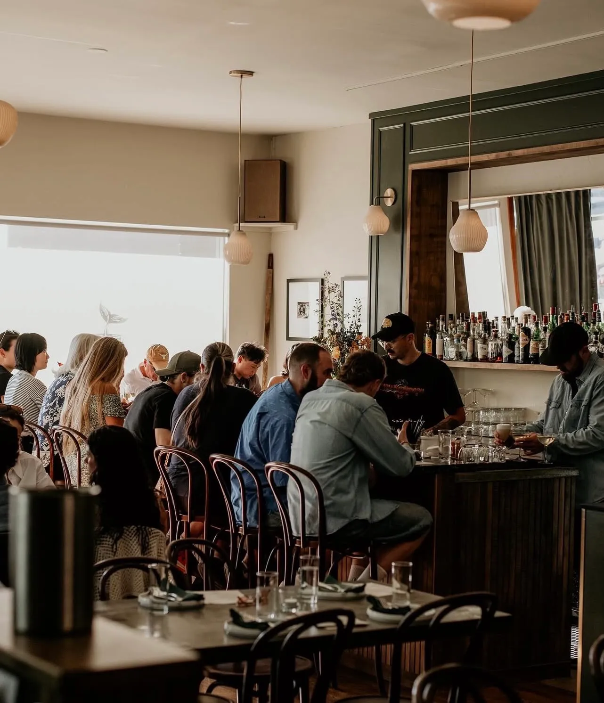
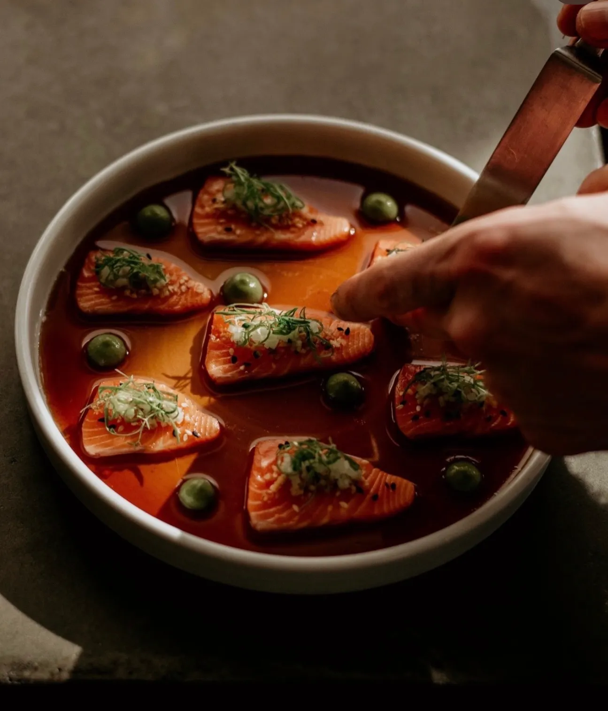
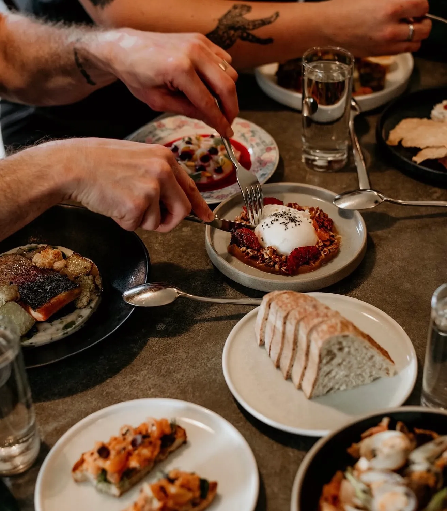

Bar Bravo buys wine by a rule. The winery has to be within a hundred kilometres of water.

It has the shape of one of those provenance claims that get written on a chalkboard and never examined, and it collapses the moment you look at the list. The bottles come from the Willamette Valley in Oregon, from Greece, from Vancouver Island. Two of those are not local by any definition Vancouver would accept, and the third is a ferry ride. Whatever the rule is doing, it is not shortening the distance between the winery and Fraser Street.

It is shortening the distance between the winery and the sea.

That is a different argument, and a better one. A restaurant that serves raw oysters, crudo and dry-aged fish is not looking for wine grown nearby. It is looking for wine grown in the same kind of air — coastal, cool, saline enough to sit beside shellfish without either one arguing. Read that way, Oregon and the Aegean and Vancouver Island stop being a scattered list and start being a single idea, applied three times.

The room applying it is small. Bar Bravo opened on Fraser Street in August 2023, sixty seats in fifteen hundred square feet that had been Ubuntu Canteen before it. Jonathan Merrill works the floor and Jonah Joffe cooks, and they met at an oyster event during the pandemic, which is either a coincidence or the least surprising origin story in the city.

The kitchen dry-ages its own fish, in a refrigerator with a glass front. That is a small decision with the same logic as the wine rule underneath it: ageing fish is the sort of work most kitchens do behind a door, and putting it in a lit case turns a technique into a statement about what the room is for.

The signature is Spencer Gulf hiramasa, which is a kingfish farmed in South Australia — roughly as far from a hundred kilometres of *this* water as a fish can be sent. It looks like a contradiction and it isn't. The rule was never about distance. It was about what belongs next to what, and a fish raised in cold clean water belongs next to wine grown in sight of it, whichever ocean either of them started in.

There is one deliberate exception, and it is the most hospitable thing on the menu: a pasta special, changed nightly, for whoever has been brought along by friends and does not eat seafood. A restaurant this committed to a single idea could reasonably decline to feed that person. This one cooks them something fresh instead.

The recognition has followed. Vancouver Magazine named it Best New Restaurant in 2024 and gave it gold for seafood in 2025, and the MICHELIN Guide lists it as Recommended. None of that changed the wine rule, which is the point of having one.

The room joined Bravo in August, alongside restaurants across Metro Vancouver.
