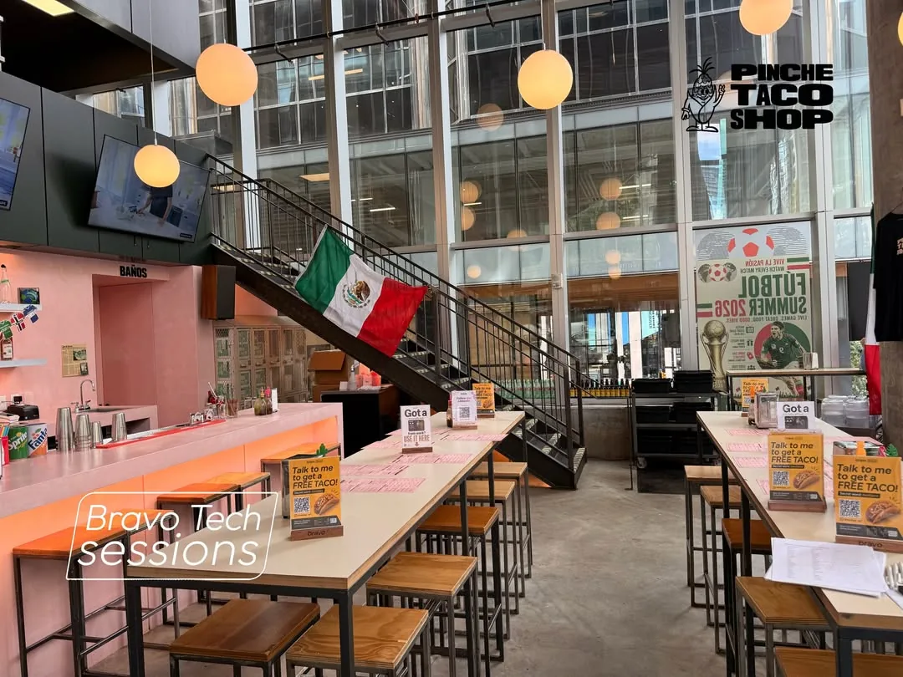
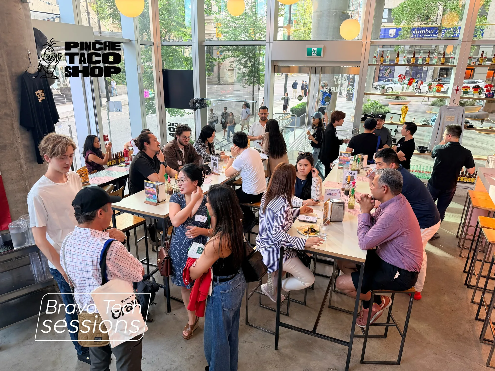
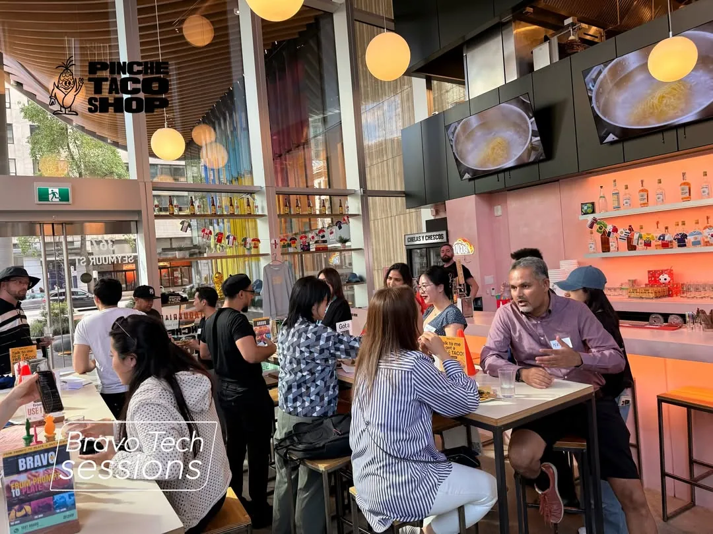

“Talk to me to get a FREE TACO,” the card said. Underneath: a QR code, a WhatsApp mark, the words *Meet Your Personal Dining Assistant*, and a secret word, **besttaco**.

One stood on every table at Pinche Taco Shop, propped up and waiting, before a single guest arrived on July 10.

What guests did with it was this. You messaged the assistant and typed the secret word. It sent back a QR code. You walked up to the counter and showed it to someone, and they gave you a taco. A second card on the same tables handled the other end of it: *Got a taco? USE IT HERE.*

That is a small loop, and on the night it was the part that actually ran.

The larger version was the one being talked about. Bravo AI Sessions Vol. 2 was billed as an evening on how artificial intelligence is changing real-world commerce, the ordinary kind conducted in rooms with counters and menus. Writing about it afterwards, Bravo asked people to imagine an agent that could find you a restaurant, secure a table at the sort of place that doesn’t have one free, and then work out who you ought to eat with. That one is a proposition, not a product. A standee by the door named the shorter ambition instead: FROM PROMPT TO PLATE.

By the time the room was full, people were standing in the aisles between the long tables and sitting along them in roughly equal numbers, phones out, canvas totes printed with *Scan. Pay. Earn.* hooked over the backs of stools, plates of tacos arriving among the water glasses and the bottles of hot sauce. Daylight came in off Seymour Street through two storeys of glass.

Pinche Taco Shop is La Taqueria’s original counter concept, revived. It spent sixteen years on West Hastings before the building came down, and reopened in November on Seymour over two floors, under a Mexican flag hung from the staircase. You order at a counter there, and the tables are long and shared, so guests sat along them in rows rather than in separate parties.

The last step is the part worth noticing. The loop did not close on a screen. It closed with a person behind a counter looking at a phone and then handing over something to eat.

Everyone in the room was wearing a name tag, written out in marker.
