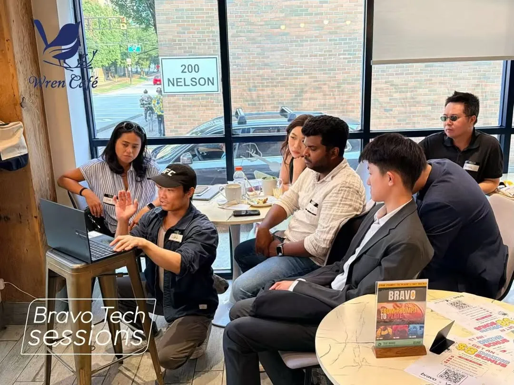
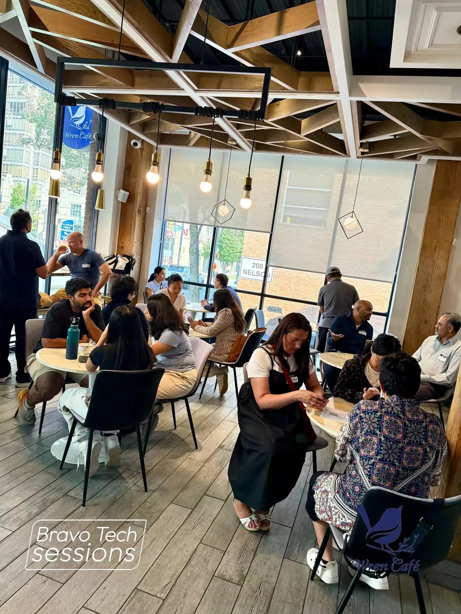
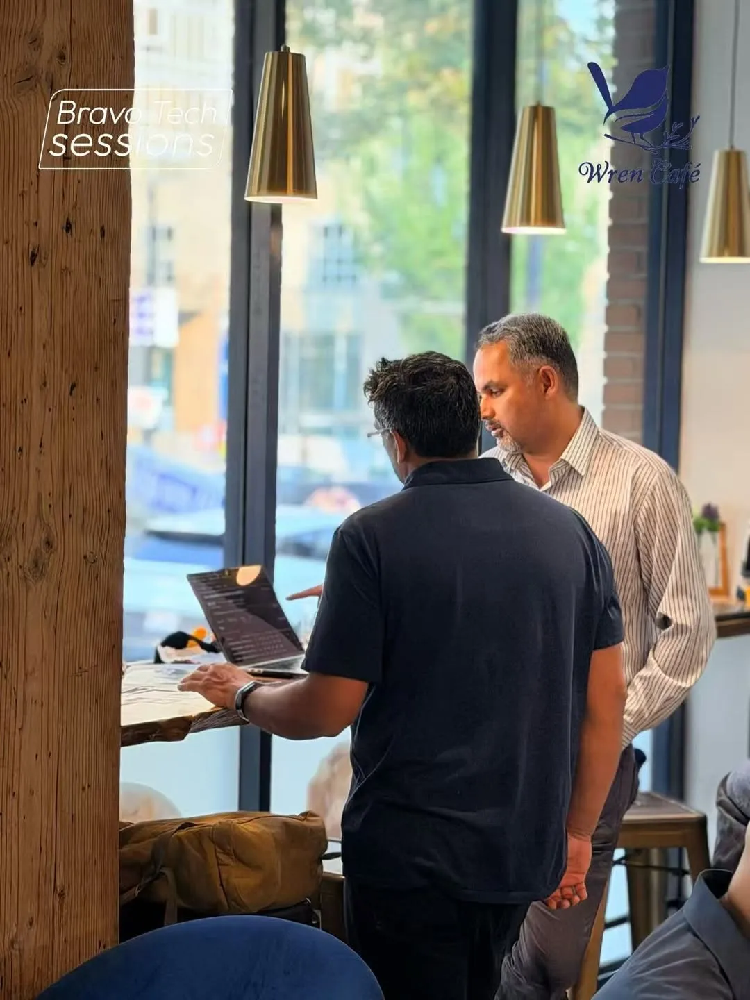
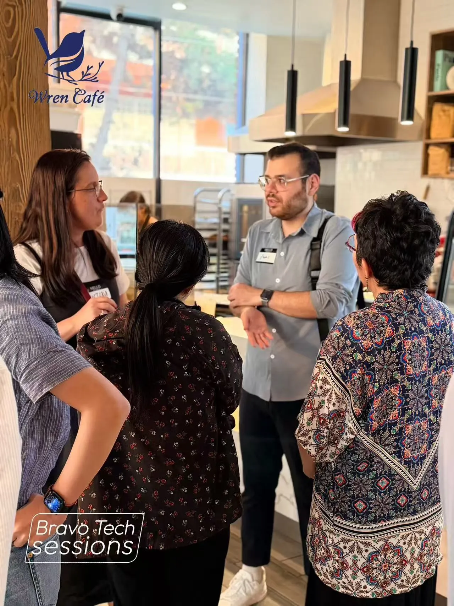

An inspiring evening exploring how AI is moving beyond chat and into real-world commerce—from discovery and booking to ordering, paying, and earning.

At Wren Cafe, we didn’t just talk about the future of agentic commerce—we experienced it firsthand with Bravo AI across a network of 500+ restaurants.

Special thanks to [WREN CAFÉ](https://www.bravoup.ca/store/wren-cafe) for hosting us in their beautiful Yaletown space and keeping everyone fuelled with amazing coffee and food.

From prompt to plate—for real. See you at the next Bravo AI Session!

