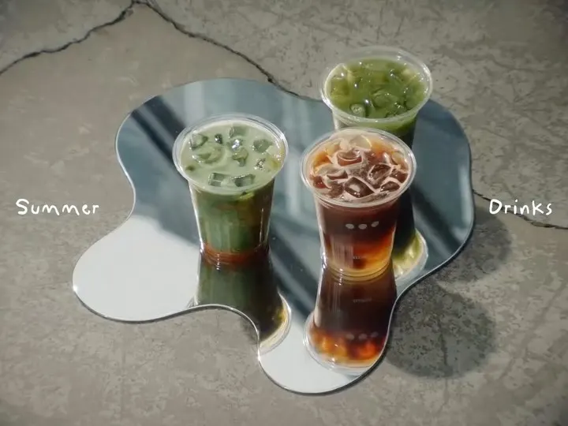
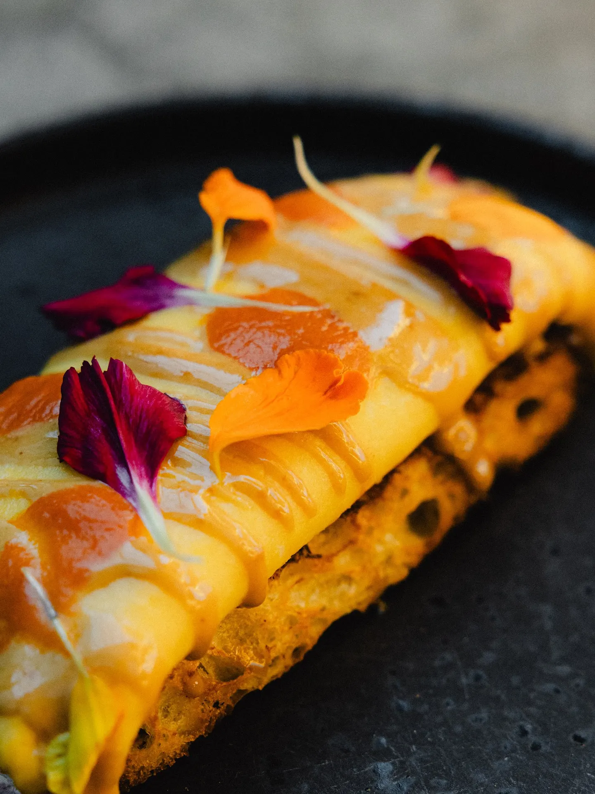
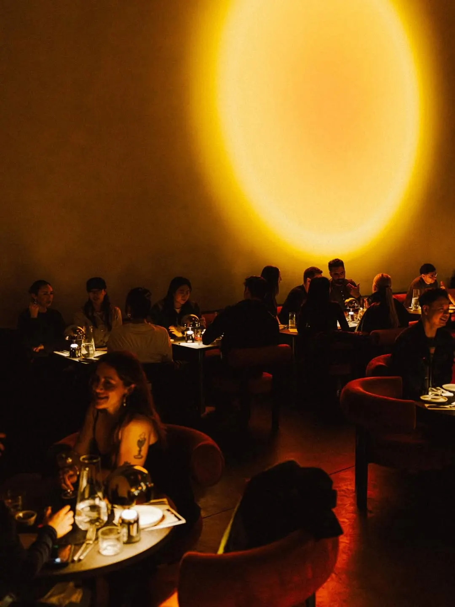
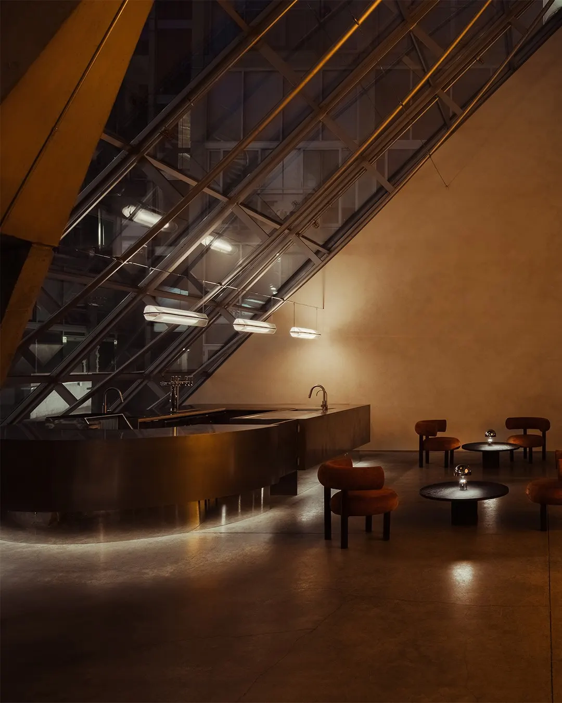
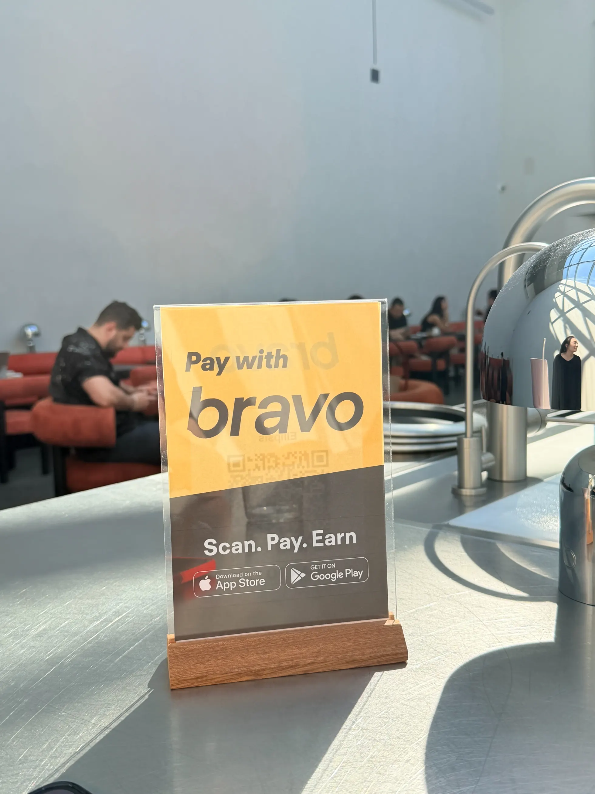

There are two bars at Ellipsis, and neither one closes when the other opens.

The room seats 47 and runs from nine in the morning until eleven at night. One bar makes coffee. The other makes cocktails. They share a pantry, and — the part most of the coverage skated past when Ellipsis opened last August — they share a clock. Owner Ming Yang has described a room where a customer can order a cocktail at nine in the morning or a flat white at ten at night. Nothing changes over in between.

That is a smaller thing than a concept and a rarer thing than it sounds. Vancouver rooms are usually explicit about what they are and when they are it. A café that becomes a wine bar puts a sign in the window. A kitchen that does brunch stops at two. Ellipsis stays open and lets you work out what sort of visit you are having.

The shared pantry is where the idea stops being a posture and turns into cooking. Seasonal syrups and ingredients cross between the two menus. A cocktail called Ca Va is built on butter-washed brandy, Calvados and croissant syrup, and arrives with a small croissant sitting on it. Matcha shows up in a cream-filled pastry. There is a burrata with peach and a trace of Earl Grey, and an omelette finished with XO sauce.

So the kitchen carries pastries and eggs early and duck and pappardelle later, and the bar works from the same jars at both ends of the day. A rotating feature drink is called, simply, “...?” Another, “What’s the Tea,” changes daily and is not written down.

The rest of the list reads like a set of opening lines: “Are We There Yet.” “What Keeps You Up at Night.” Groups larger than six have to enquire in advance, which suggests a room measured in conversations rather than covers.

The building never committed to one function either. Ellipsis sits inside Arthur Erickson’s Waterfall Building, in a space originally intended as an art gallery, and the conversion left the shell largely alone: both metal bars stand free of the walls rather than fixed to them. After dark, a circle of light is projected onto the back wall, which is roughly the extent of what the room does to mark the evening.

The awkward part is finding it. Ellipsis has no street presence to speak of. You reach it through a courtyard off West 2nd Avenue, past a water curtain, on a block most people drive along rather than walk, usually on their way somewhere else on Granville Island. Nothing about the approach announces a bar. That is a real cost for a room that depends on people knowing it is there, and it is the strongest argument for the fourteen-hour day: if a customer cannot happen upon you at seven in the evening, it helps to be available at ten in the morning, and at two, and at nine. Ellipsis recently joined Bravo, alongside restaurants across Metro Vancouver.

In April the cocktail bar handed a shift to Tom Liu, of Thunderbolt in Los Angeles, from five until close, an evening event in a room that had by then already been open for eight hours.

