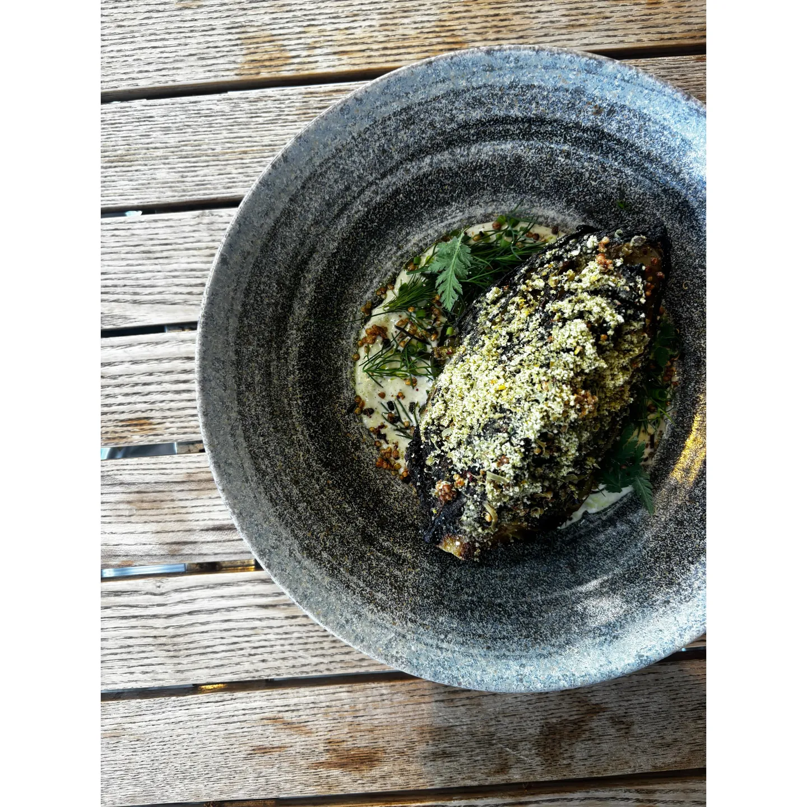
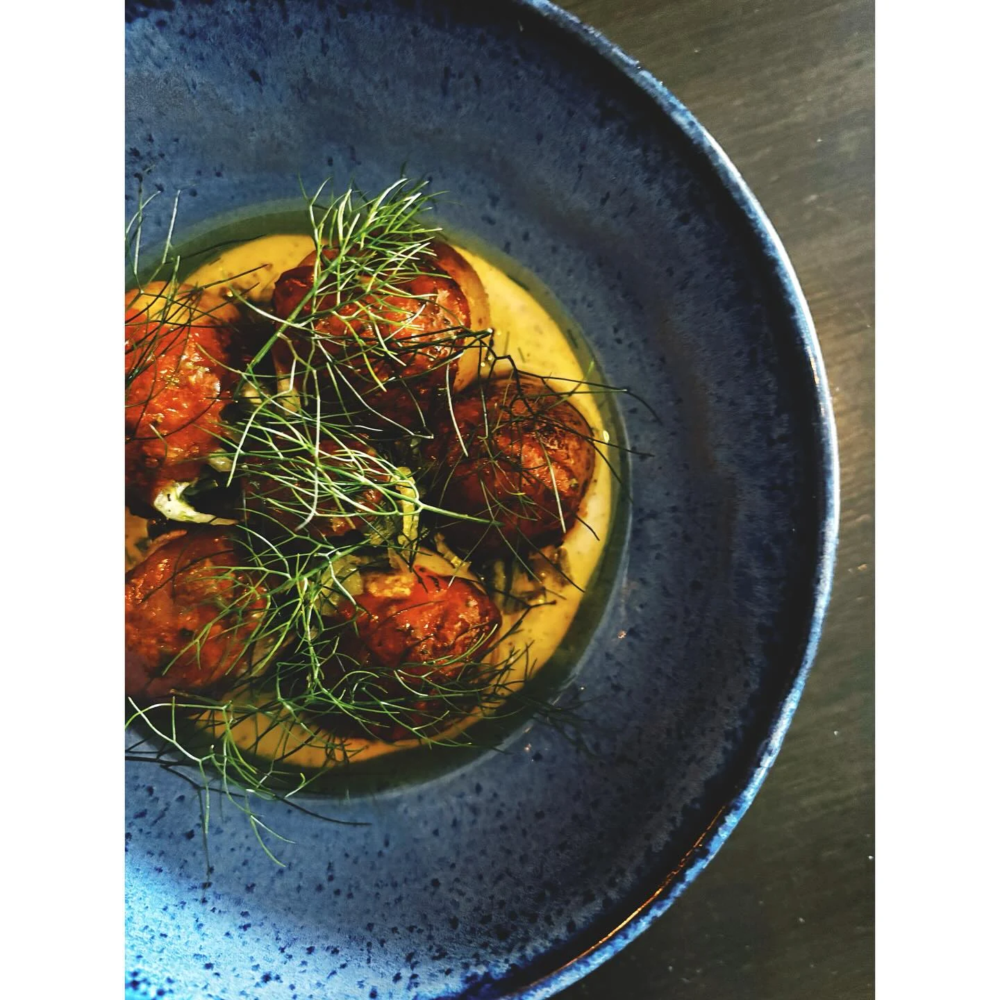
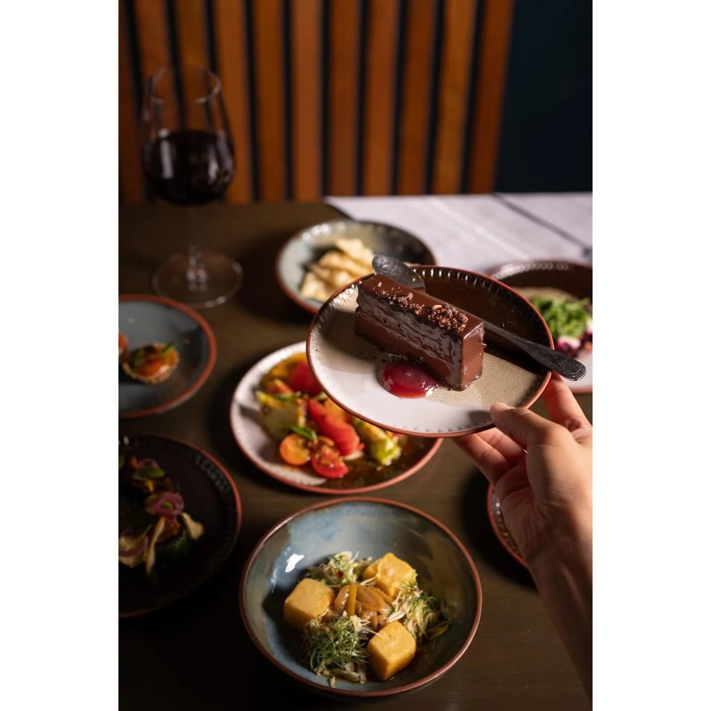

Folke does not take tips. The number printed beside a dish is the number that leaves your account, which sounds like a small courtesy to the customer and is really about somebody else.

What the owners put inside that number is a kitchen on salary rather than on hours, a four-day working week for the chefs, and benefits and lifestyle spending accounts that staff pay nothing into. Pricilla Deo, who owns the restaurant with Colin Uyeda, has described the arithmetic without any romance at all: the pricing, she told *Stir*, has to cover “all aspects of running a business such as overhead costs, wages, and rising food prices.”

The model has a name, hospitality included, and one cost in that list is the one restaurants conventionally leave off the menu, to be settled afterwards, in cash, at the discretion of strangers. Folke moved it inside.

Doing that has an obvious commercial problem attached, which is that the number on the page gets bigger. A restaurant that folds wages into its prices is competing, on the same street, against restaurants that do not, and it has to persuade people that a larger figure printed on the menu is in fact the same money, or less once the arithmetic at the end is done honestly. That is a harder sell than a policy, and it is renewed every night the room fills or doesn’t.

The reason is not abstract. Deo and Uyeda had both spent their working lives in hospitality — they met through social media while cooking in different countries, and landed in Vancouver within months of each other in the autumn of 2016. They worked the restaurant out during the pandemic, when Deo had been laid off from pastry work and Uyeda was at Kissa Tanto. “We both had always had careers in hospitality,” Deo told *Scout*, “and wanted to do something different that helped it feel more like a stable career for people.”

That is a sentence written by someone who has been on the other side of a slow Tuesday.

Folke opened on West Broadway on the second of June, 2022, and the thing that makes the labour model interesting is that it is attached to a genuinely ambitious kitchen rather than to a modest one. Uyeda cooked at RyuGin in Tokyo, which holds three Michelin stars, and at Relæ in Copenhagen. He now deep-fries chickpea flour into cubes of tofu and serves them with turnip and zhoug, roasts and dehydrates and smokes beets until they can be served like tartare, and folds mushroom XO into tapioca dumplings. Deo’s desserts run to parsnip cake with umeboshi plum caramel.

Neither of them is vegan. The menu is, entirely, and nothing on it imitates meat — the subject is vegetables rather than abstinence, which is a harder brief and a more interesting one.

Four years in, the kitchen has been named to Air Canada enRoute’s Canada’s Best New Restaurants and listed as Recommended in the MICHELIN Guide. Neither of those is the part that is difficult. Any good restaurant can be praised for a season. Keeping salaried chefs on a four-day week inside a menu price that customers still agree to pay, through four years of the food costs Deo mentioned, is the part that takes doing.

Folke joined Bravo in July, alongside restaurants across Metro Vancouver.
