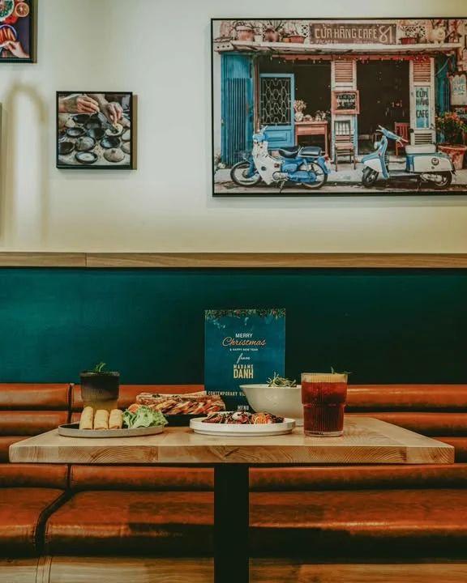
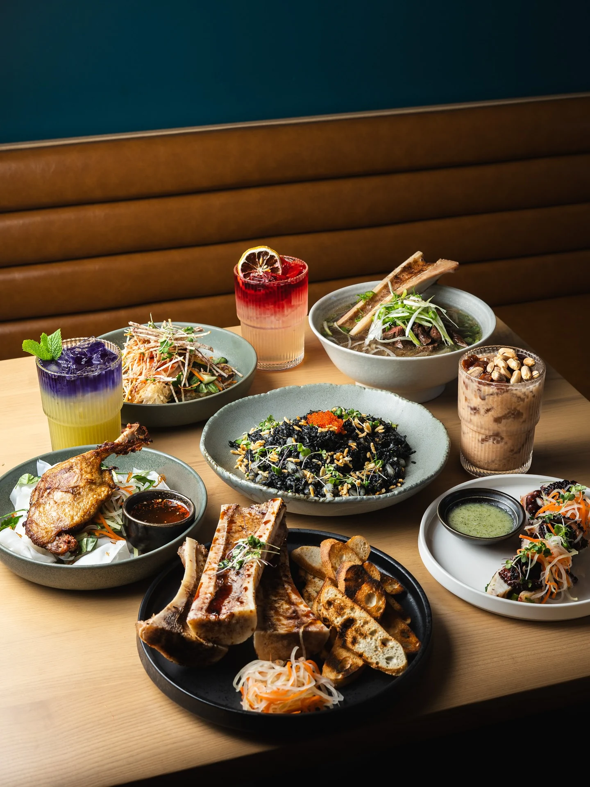
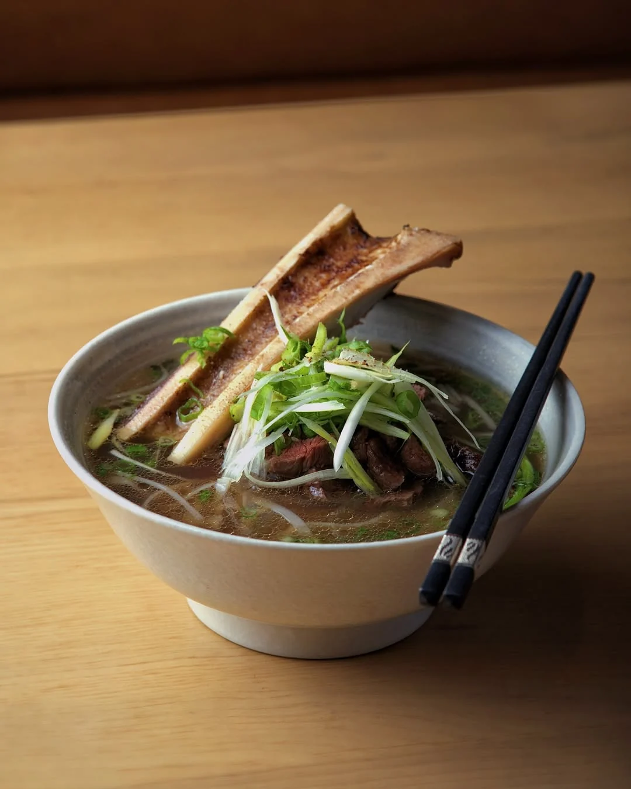
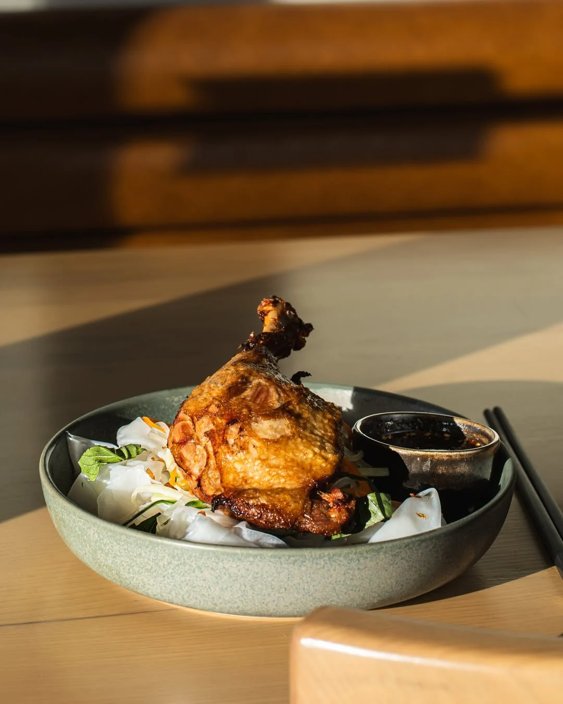
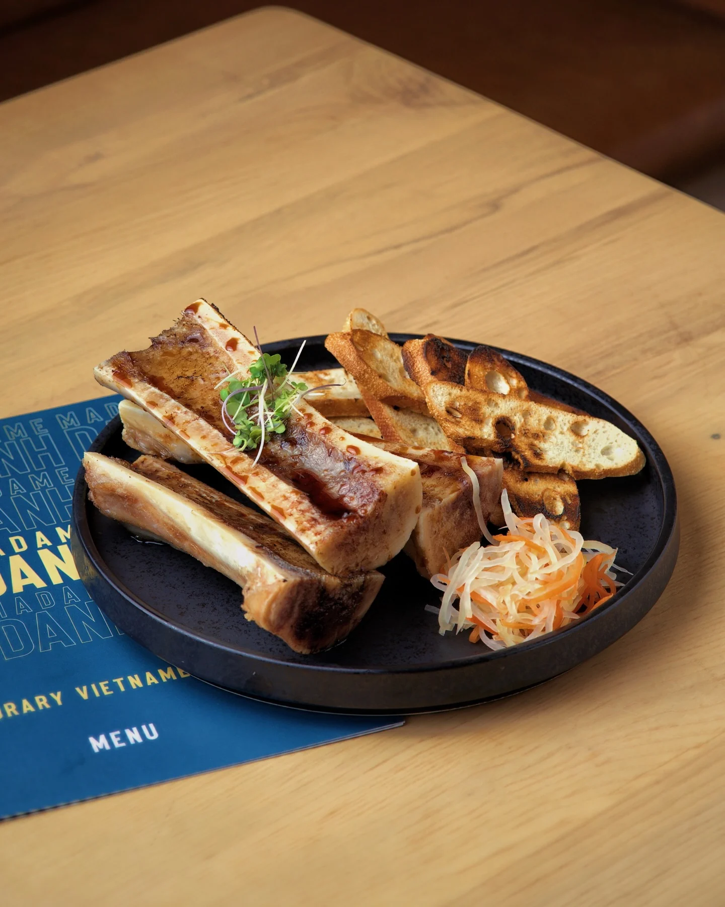

You can put a roasted bone marrow on your phở here.

That's it, that's the pitch. Order the grilled steak phở, add the marrow, and it arrives with the bone standing up in the broth like it's been planted there. If you're the sort of person who was always going to order that, you can stop reading and go.

## Everything else worth getting

The **squid ink fried rice** is the one I'd fight for. It comes out black, scattered with puffed rice and a spoonful of tobiko, with squid and dried scallop and egg through it. The food blog Mag Mei Adventures called it *"airy and light"* and not greasy, which is not the usual problem with fried rice.

The **charred octopus** comes with a chilli sauce that, in the same write-up, *"actually tingled as it burned so good."* I didn't write that sentence and I'm slightly annoyed about it.

The **grilled pork jowl on rice** gets described as some of the most tender meat that writer had eaten. Jowl usually is, and it's usually not on the menu.

The **carrots** are roasted and glazed with maple and fish sauce, then finished with crispy almonds. They're on the menu as Carrots à la Marble and they behave less like a vegetable than anything else on the table.

Then there's the **bún bò Huế**, a spicy beef noodle soup from the old imperial city. It's a weekly special and they make fifteen bowls a day. Go early or don't go for that.

The drinks are doing their own thing. Kumquat red tea, marble green milk tea, and a butterfly pea sugarcane that comes out in two colours and doesn't stay that way.

## Whose living room this is

Sixteen seats on Fraser Street, in the stretch of Vancouver that's started calling itself the Fraserhood. Light wood, burnt orange, dark teal, and family photographs all over the walls. Street vendors, a cafe beside the railway tracks, the market at Đà Lạt. They're the family's own photographs, which is why the room feels like somebody's front room and not a set.

Madame Danh is the chef's grandmother. *Madame* is French, an honorific; *Danh* is her family name. She was raised in the French Catholic Church until she married, and she left Vietnam for Canada in 1986.

She also still comes in and sits down in the room with her name on it. I think about that a lot.

Her grandson Tyson cooks. He grew up in Vietnam, learned from his mother, moved here in 2012, then worked at Cactus Club, West, Miku, Como Taperia and Nemesis Coffee. His sister Vi works there too.

## Before it was this

This address was Golden Joy for seventeen years, a Filipino cafe doing adobo and barbecue pork noodles, until it closed quietly in 2024.

One family's long run, then another family's first go, in the same room.

Madame Danh joined Bravo in August. Bravo is a restaurant discovery and social dining platform working with restaurants across Metro Vancouver.
