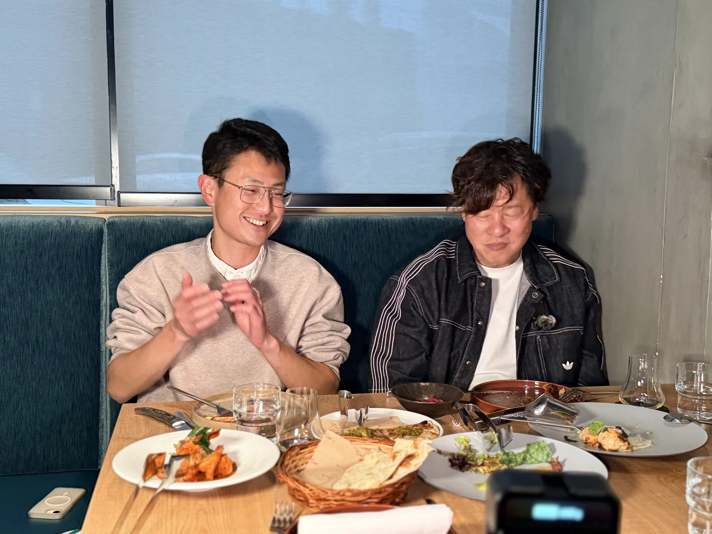
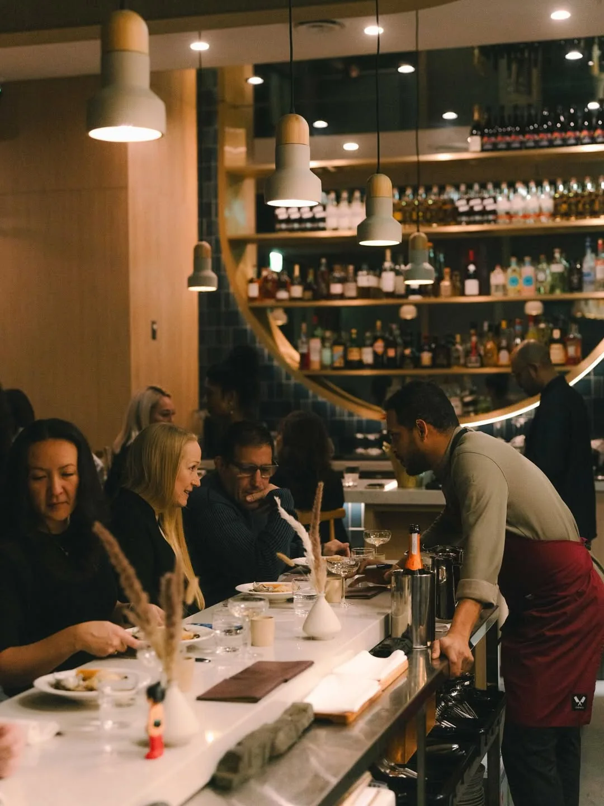
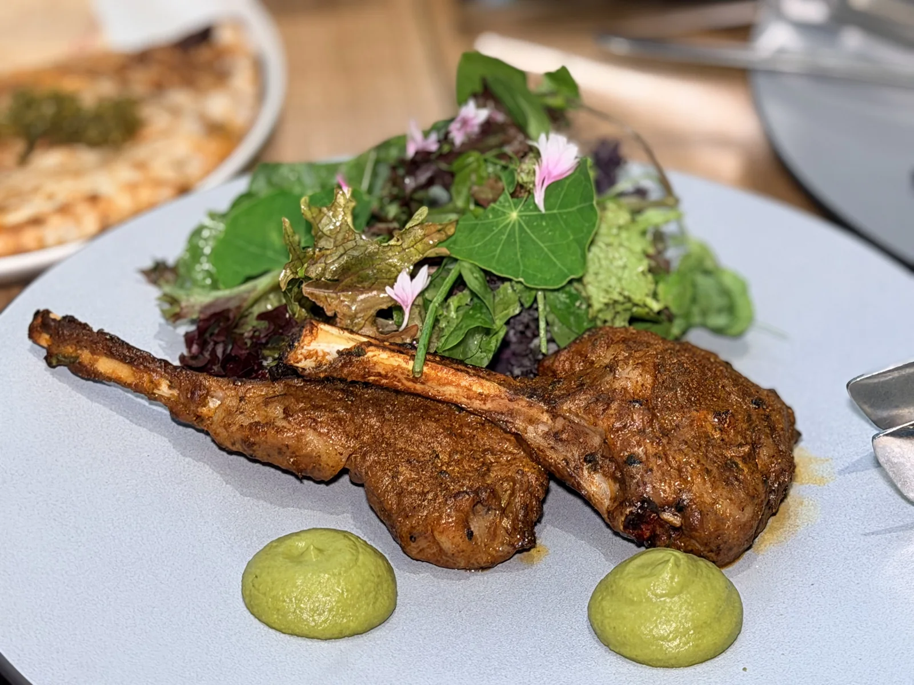
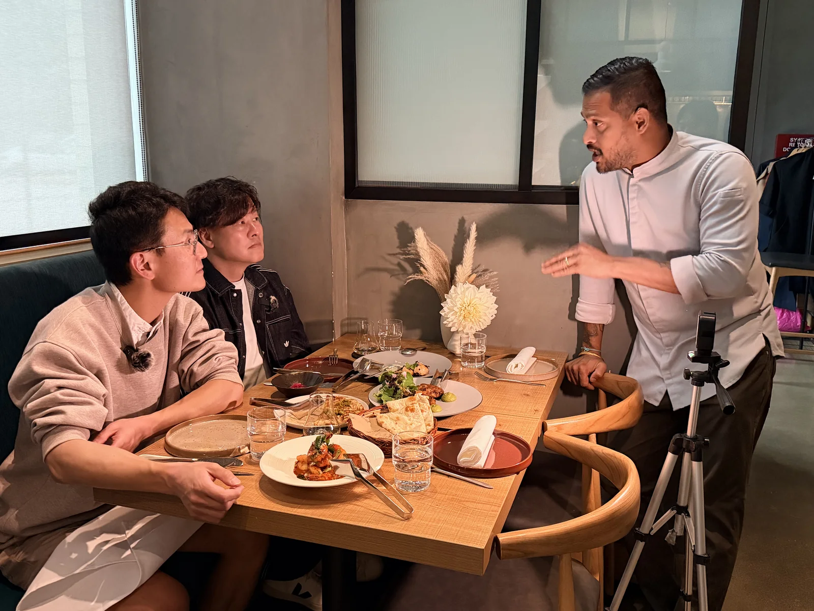

Kavita is a small Indian restaurant on West 3rd Avenue, in Olympic Village. Forty-six seats, and a kitchen you can see from most of them. It opened in October 2025. By this summer it was 96th on Canada’s 100 Best Restaurants and had won Vancouver Magazine’s gold for Best Indian.
## Who went, and why that matters

Max So, Bravo’s CEO, went for dinner and brought Jacob Ung with him, which was a smart choice.

Jacob has been writing about restaurants since 2012, first as Premeditated Gluttony and now as Just Savour Life. He’s also the COO of the Chinese Restaurant Awards. On his own site he’s blunt about how he works: “No meals traded for reviews, in either direction. No paid reviews.”

He’s just as clear about what he’s looking for. Food, he writes, is mostly the excuse: “the people at the table are more interesting than what’s on it.”

Which suits this place, because Kavita is a person.

## The name is a person

Kavita was his mother’s name. She’s gone now, and when he finally opened a place of his own he put her name on the front instead of his. The word means poetry, too.

He’s Tushar Tondvalkar, and he’s from Mumbai. He cooked at Gaggan and Gaa in Bangkok, both Michelin-starred, then came here and worked through Blue Water Cafe, Bauhaus and the Fish House in Stanley Park. He ran the kitchen at Mumbai Local before this. So Kavita is the first room that’s really his, and he gave it to her.

She taught him, is the short version. He told VITA Daily a week before this dinner: “I grew up in the kitchen with my mother and grandmother. They inspired my love of cooking.”

## Why a kebab counts as Indian

Over the kebabs, Tondvalkar explained how he decides what goes on the menu. It’s the best answer to “is this authentic?” I’ve heard in a while.

Kebabs came to India from outside. Persian and Iranian invaders brought the skewer and the open fire. Indian cooks took the method and cooked it with their own spices, and after a few hundred years the dishes were Indian.

So a kebab isn’t less Indian for arriving late. Same goes for the naan here, which comes stuffed with chilli, cheese and garlic. That’s traditional nowhere at all. It’s the same borrowing, still happening.

**What I’d order:** the lamb chops. They go into the tandoor under garam masala and a Bengali five-spice mix called panch phoron. There’s no butter chicken here, so don’t go looking for it.

The produce comes from local farms and the meat from local butchers. That matters more than it sounds for this kind of cooking, which usually travels frozen and lands anywhere.

Ask Tondvalkar how a one-year-old restaurant ends up on a national list and he doesn’t talk about technique. He credits his kitchen and his floor staff. His general manager, Yash Shah, has been his friend since kindergarten.
