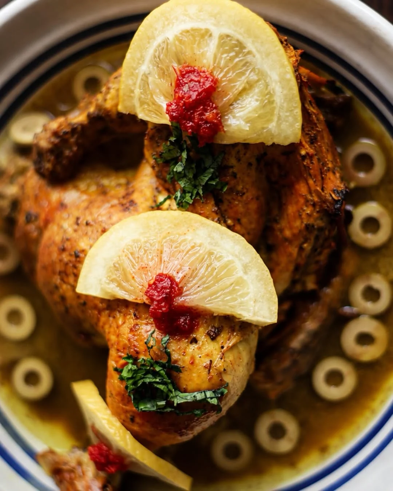
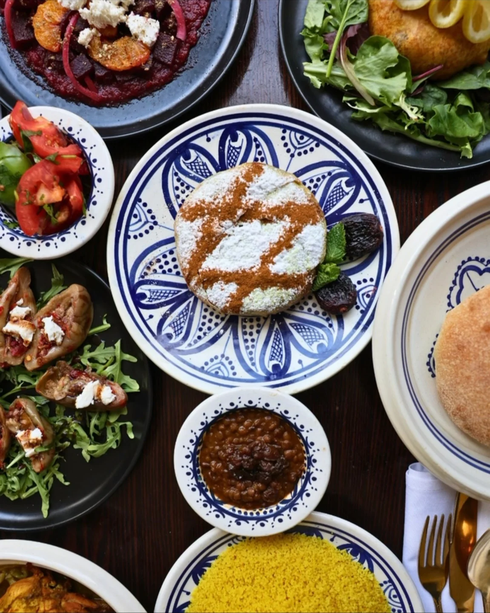
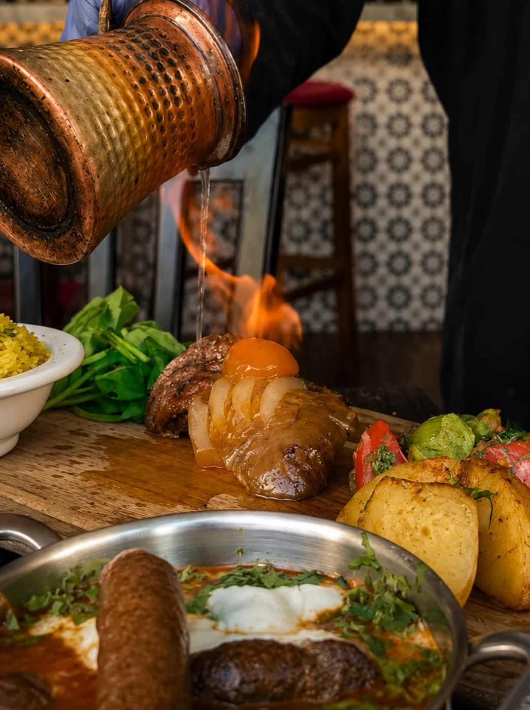

Moltaqa is a Moroccan restaurant on Mainland Street in Yaletown, a few minutes' walk from BC Place. The name is Arabic. It means a meeting place, the spot where things come together.

The restaurant's own website never actually translates it. It says the place is somewhere people come together over food and culture, which is what the name means anyway.

The menu is more direct. Moltaqa cooks Moroccan food built out of four traditions: Berber, Arab, Andalusian and French. Plenty of restaurants write a line like that to sound worldly. This one means it literally.

## What to order

The pastilla. It's the one dish that holds the whole idea on a single plate. Pastry thin enough to see through, wrapped around spiced poultry, then dusted with icing sugar and cinnamon.

Sugar on savoury meat sounds wrong until you eat it. That's the part people remember.

Vancouver Magazine gave Moltaqa gold for Best African and Diaspora in 2026, its second year running. It picked out two plates: the chicken pastilla and the flambé rack of lamb. One is Andalusian. The other is French. Both are on a Moroccan menu in Yaletown.

## The four cuisines, quickly

First, the Berbers. Theirs is the base, and the tagine comes from there. A tagine is the cone-lidded clay pot and the slow stew that cooks in it, built for a place with little fuel to spare. Couscous is theirs too.

Then Arab traders, who brought the spice and the preserving. That's why the chicken sits under salted lemon and olives instead of a sauce.

After 1492, Andalusians crossing over from Spain, with pastry and with a taste for sweetness inside savoury food. That's your pastilla.

Last, the French, who governed Morocco for forty-four years and left technique behind. The flame, the reduction, the show at your table. That's your flambé lamb.

Four cuisines, arriving over about thirteen hundred years, in one country. A meeting place.

## Eight years in

Mimo Bucko opened Moltaqa in 2018 on West Hastings, in Gastown, and still owns it. It moved to Mainland Street later. The MICHELIN Guide has recommended it since 2023.

The kitchen is fully halal-certified and grinds its own spice blends from spices brought in from Morocco. Mint tea gets poured at the table, from a height, which is its own small piece of the same history.

Eight years is long enough to stop being the new place and not long enough to be taken for granted.

The name isn't a claim about fusion, either. Fusion is a modern idea about putting separate things together. This is the older version: cuisines that met a long time ago, in a country that didn't get much choice about it, and stayed.

Moltaqa joined Bravo in May, alongside restaurants across Metro Vancouver.
