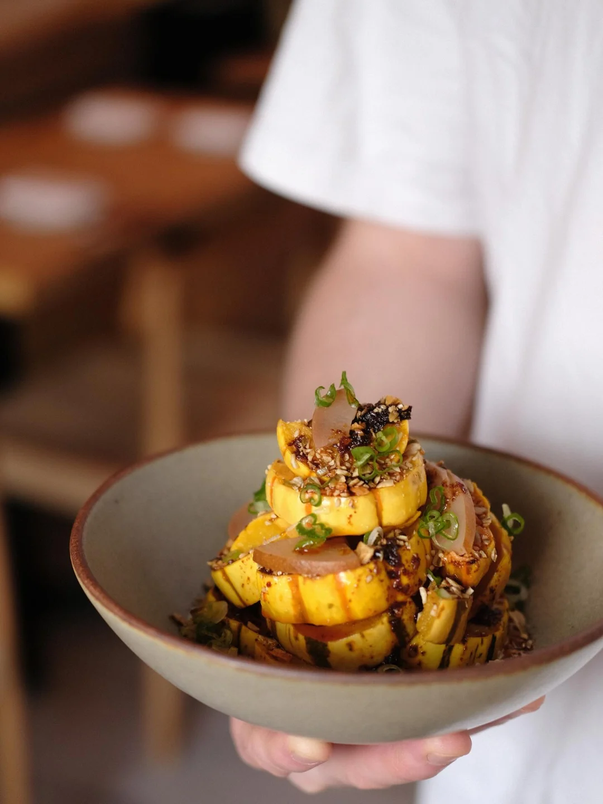
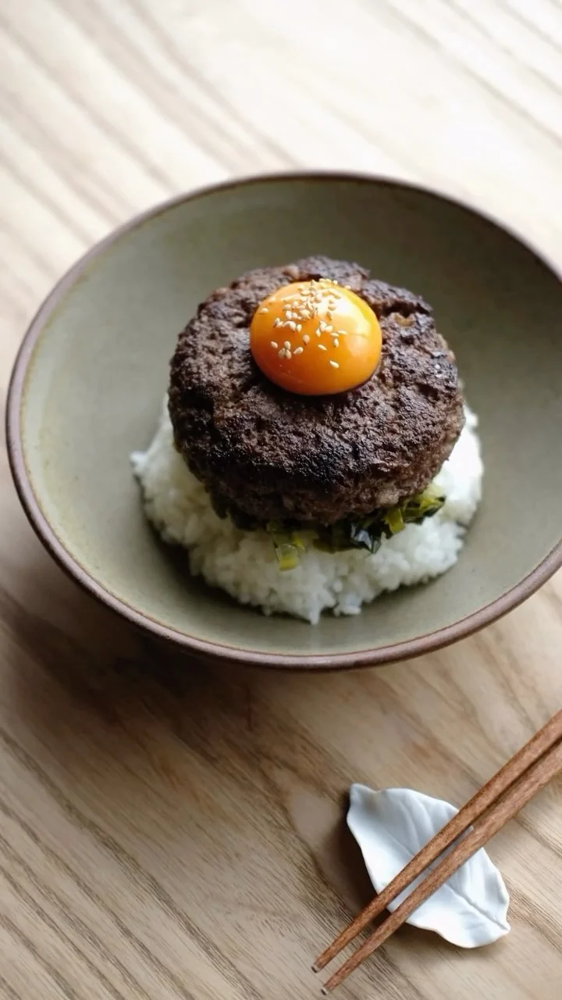
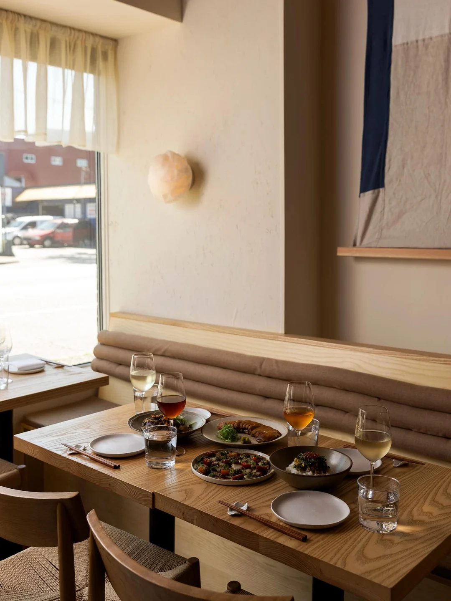

Niwa means garden in Japanese. There are chopsticks on the table, an omakase if you want one, and a list that leans on sake. By any reasonable test the restaurant on Powell Street is a Japanese restaurant, and its owners will not say so.

“There are a lot of things about Niwa that nod to or seemingly feel a bit more Japanese,” Miki Ellis has said, “but by no means do we want to be a Japanese restaurant.”

That reads at first like the kind of thing restaurants say to avoid being put in a box. It isn’t. The reason is upstream of the dining room, in how Darren Gee has arranged the kitchen.

Gee cooks to what the farms send. Nearly all the produce and protein is local, animals arrive whole rather than as the cuts a menu would order, and what cannot be used gets divided with other kitchens. “What we’re really trying to do is tell the story of producers and the things that are happening around us seasonally,” he has said. And, more plainly: “It’s nice that the season and the ingredients dictate what you’re going to make.”

Follow that through and the label becomes impossible. A cuisine is a promise about what will be on the table — a Japanese restaurant undertakes to have certain things, more or less, whenever you arrive. A kitchen that lets the season decide cannot make that promise, because in February it has no idea what March will bring. What it can offer instead is the narrower and more demanding assurance that whatever does arrive will have been worth cooking.

So the Japanese element is real but partial. It shows up as technique and as seasoning — shio koji, yuzu kosho, bonito, a dashi — rather than as a category the menu has to keep faith with. The kitchen has sent out charcoal-grilled leeks with shoyu butter, pickles of yellow carrot and cucumber and white turnip, hand-cut pasta with uni and kabocha, and a duck breast aged five weeks. Only some of those belong to any one cuisine. All of them belong to a particular week in Vancouver.

The room says the same thing quietly. Claire Saksun’s design is muted and austere, a burnt terracotta ceiling over light wood and earth-toned textiles, and it declines to signal a country the way restaurant rooms usually do.

Niwa opened in December 2024. Gee runs it with Robin Corbett, Miki Ellis and Stephen Whiteside, a group assembled out of Dachi, Ugly Dumpling and Hānai, and within a year Air Canada enRoute had placed it tenth on its list of Canada’s best new restaurants — the strongest national showing of any room we have written about.

None of which required a category. It is a harder way to run a restaurant and a harder thing to explain to somebody deciding where to eat, and the achievement is that enough people have stopped needing the explanation.

Niwa joined Bravo in May, alongside restaurants across Metro Vancouver.
