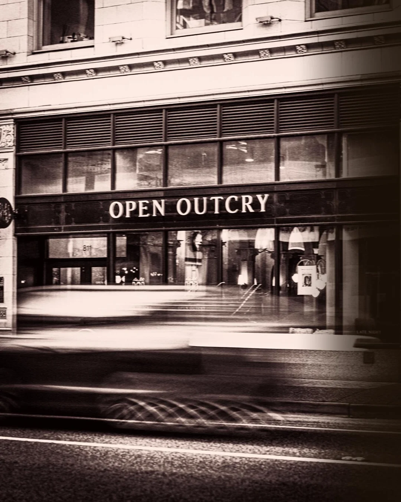
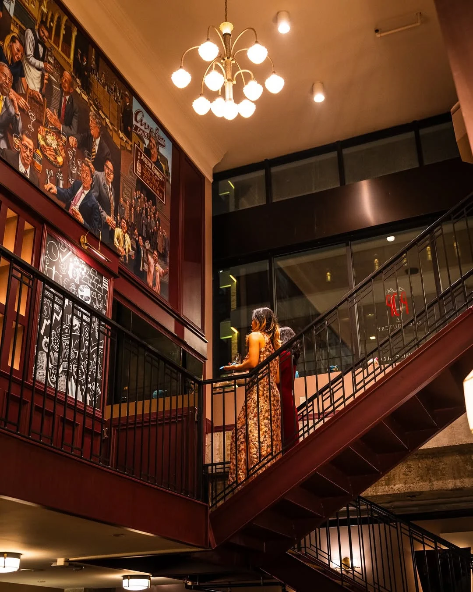
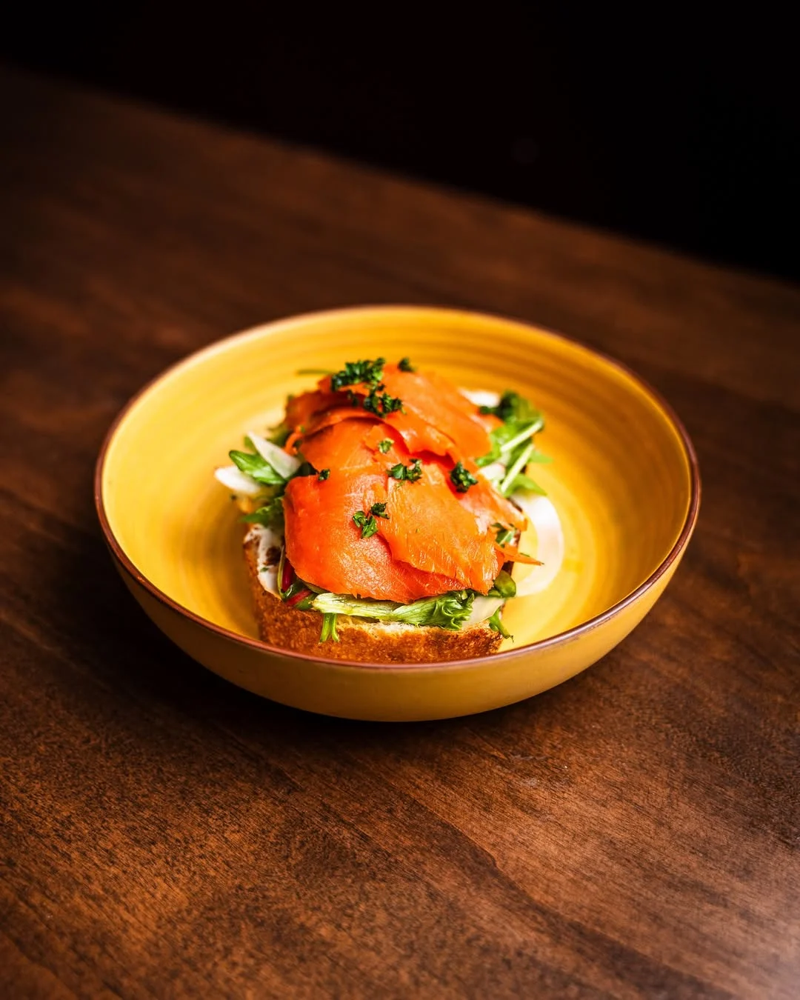
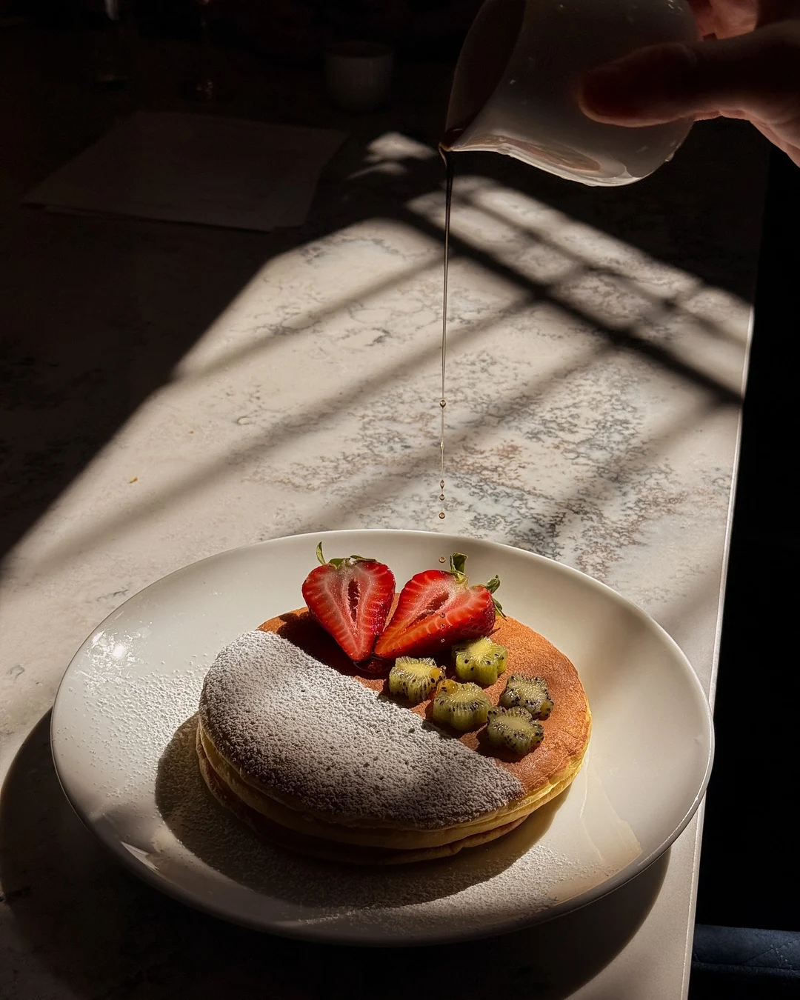

The sign on West Pender says OPEN OUTCRY. Underneath it, two animals in evening dress are holding hands, and each of them has a martini.

One is a bear in a top hat. The other is a bull in a tie. They appear to be dancing.

## What the two animals are for

A bull market is one going up. A bear market is one going down. They are the only two moods money has, and they are meant to be opponents: every trade needs somebody who thinks the price is about to rise and somebody who is sure it's about to fall.

On this sign they've put the argument down and got a drink.

As far as I can tell nobody has ever explained the joke, and it doesn't need explaining. The fight is off. The two of them are out for the evening.

## Something really did stop here

*Open outcry* is a way of trading, and it is the reason the restaurant has that name.

Before computers, buying and selling happened out loud. Prices were shouted across a pit, and hands did the numbers over the top of the noise. Palms turned outward meant you were selling. Palms turned in meant you were buying.

It was a language, and it was spoken in this building. 811 West Pender went up in 1929 as Vancouver's first modern stock exchange, a few months before the Crash, designed by Townley, Matheson, the firm that would later build City Hall. The trading floor is the room you eat in.

The exchange moved out in 1946. The shouting lasted longer elsewhere, and then it stopped there too: London in 1986, Toronto in 1997. A way of talking that thousands of people once knew by heart became something you have to look up.

The mural is still on the wall, a crowd of men in suits, which is a strange thing to eat under and a good one.

## What gets carried across the floor now

Softer things than the room was built for. There is toast, with cold-smoked salmon on it, or with prosciutto and pomegranate seeds. There is burrata, and there are anchovy tarts, and beef cheeks, and prawns with pappardelle. And there is a meatball called the Outcry, which has been on the menu since the room first became a restaurant in 2019, through a closure and a reopening.

On Saturdays there is brunch, and somebody pours syrup over a stack of pancakes in a room that was built for arguing about money.

I haven't eaten there, and nobody at Bravo has. Bravo is the Vancouver restaurant app that publishes this magazine, and Open Outcry is listed on it. I would go for the room first and make my mind up about the food once I was sitting in it.

## The bear is wearing a hat

That's the part I keep going back to. Not the martini. The hat.

Somebody drew a top hat on a bear, with a small bow on the brim, and sent him in to dance on a floor where fortunes were shouted away. The market never stopped being a fight. It just stopped being one you could hear from the street.
