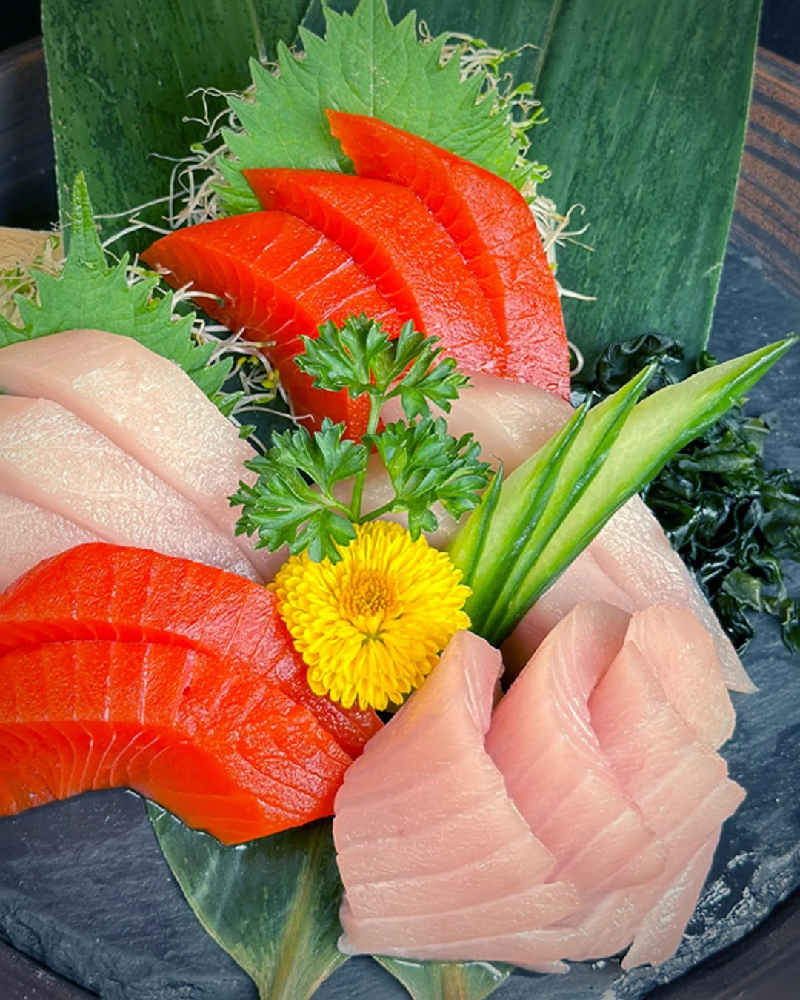
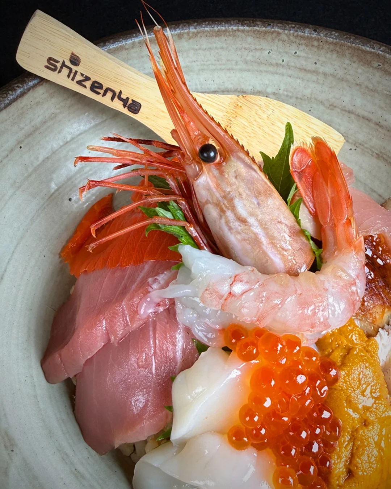
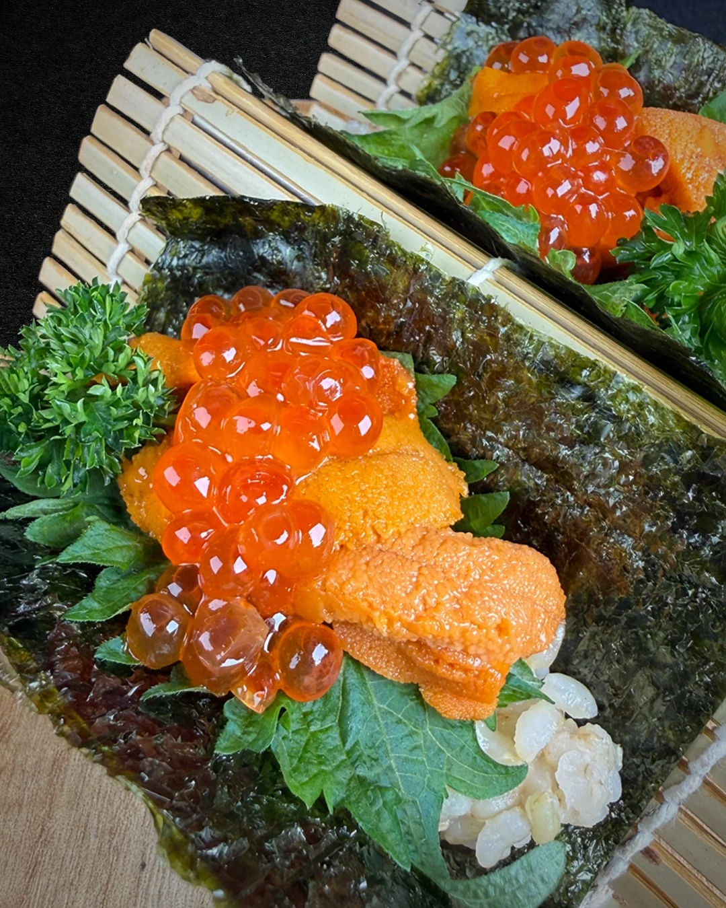
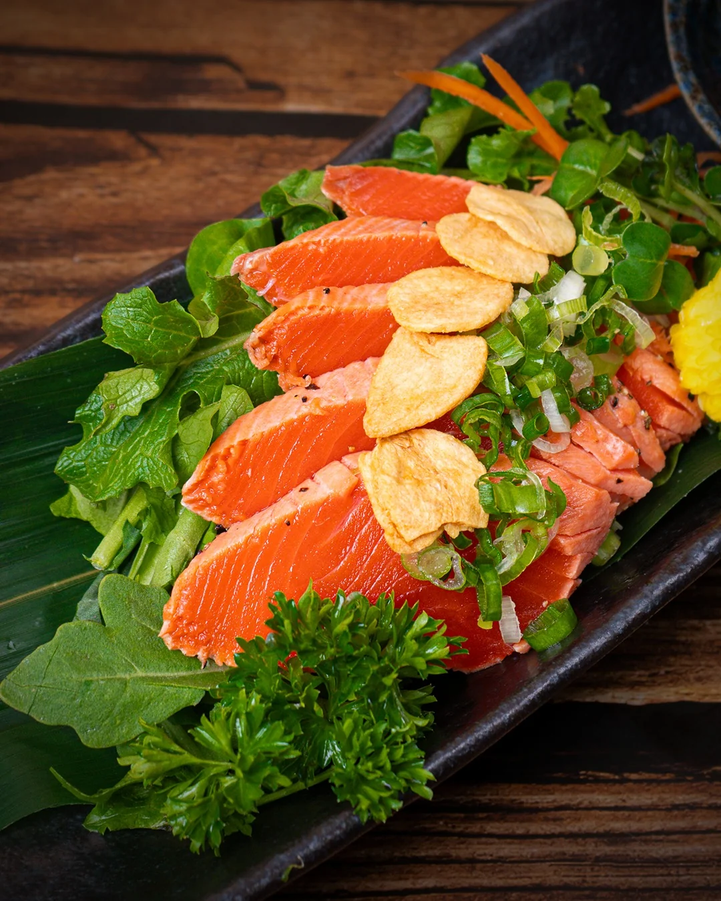
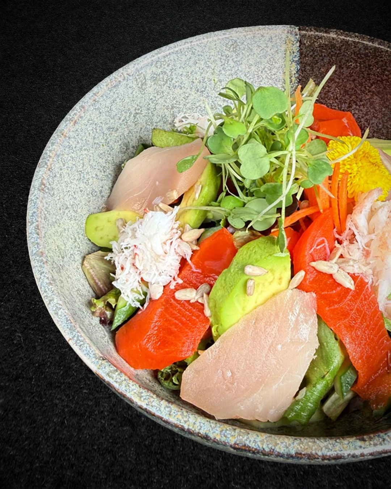

In 2009, a man opened a sushi restaurant in downtown Vancouver and decided it would not serve white rice.

Not "brown rice also available." Not "ask your server." None. In a city people fly to for sushi.

Seventeen years later, it still hasn't budged.

## What he was betting against

Ask a sushi chef and a fair few will tell you the rice *is* the sushi. The fish gets the attention, but the thing being made is seasoned rice, and everything else sits on top of it.

Brown rice doesn't behave the same way. It's chewier, it holds together differently, and it will not quietly do what white rice does. Choosing it means choosing a harder version of your own job, every service, forever.

Shizenya chose it anyway, and describes itself as the first Japanese natural food restaurant in North America.

## It went further before it went smaller

The easy version of this story is a restaurant that softens over time. That isn't what happened.

A second room opened on Broadway in 2011. The original moved up the street in 2017. A third opened on Denman in 2018. Three rooms, no white rice in any of them, and the rest of the menu went the same way.

The teriyaki is made without oil. The tempura is whole wheat. There's inari made with organic quinoa, and a curry with no MSG in it. The wasabi is real wasabi, not the dyed horseradish almost everywhere serves and nobody mentions.

That last one is the tell. Nobody is checking. They did it anyway.

Then it got smaller. Denman closed in 2022. Broadway closed in May 2024, after thirteen years. One room is left, the one on Hornby, and the rice in it has not changed.

## What to order

The chirashi, if the uni is on. It comes with a whole spot prawn lying across the top and a stripe of ikura beside it. Nothing about it looks like a compromise.

The sashimi platter if there are a few of you. Sockeye and albacore are both caught locally, and the seafood is Ocean Wise, the sustainable-seafood programme.

The salmon tataki, seared at the edges and still raw through the middle, which arrives under potato chips. I have no notes on that. It works.

And the hand rolls, which are where the brown rice stops being a talking point and just becomes lunch. That's the whole promise, delivered without a lecture.

Ordering a brown rice roll in Vancouver now gets you a shrug. It didn't in 2009, and somebody had to be the first person to look silly.

Shizenya joined Bravo in September. Bravo is a restaurant discovery and social dining platform working with restaurants across Metro Vancouver.

*Correction, 23 September 2026: an earlier version of this story said Shizenya had three rooms, without noting that the Denman location closed in 2022 and the Broadway location in May 2024. It also credited the 2009 decision to Hide Hirose, who is on the record as the company's president in 2018 but is not sourced anywhere as its founder. Both have been corrected.*
