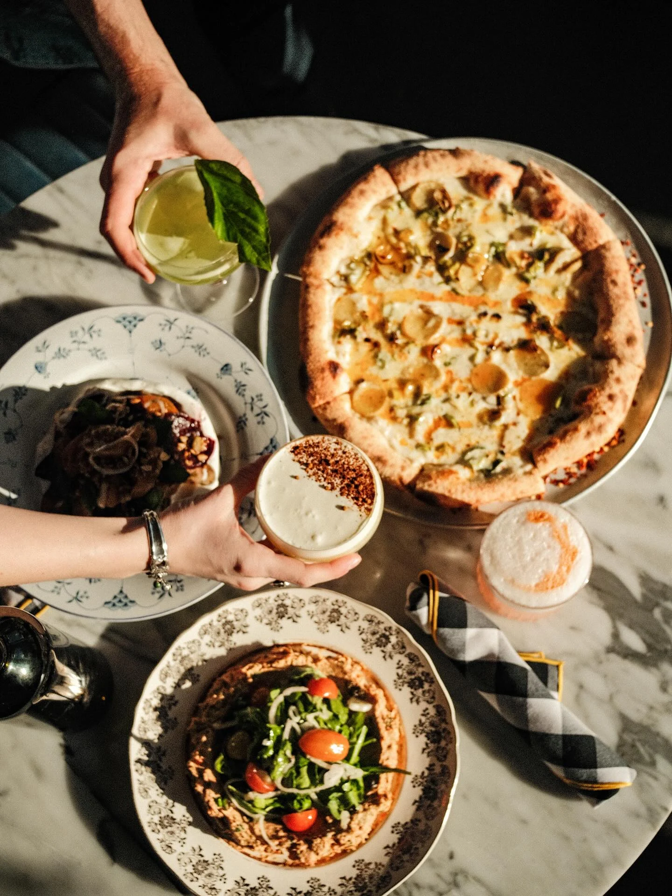
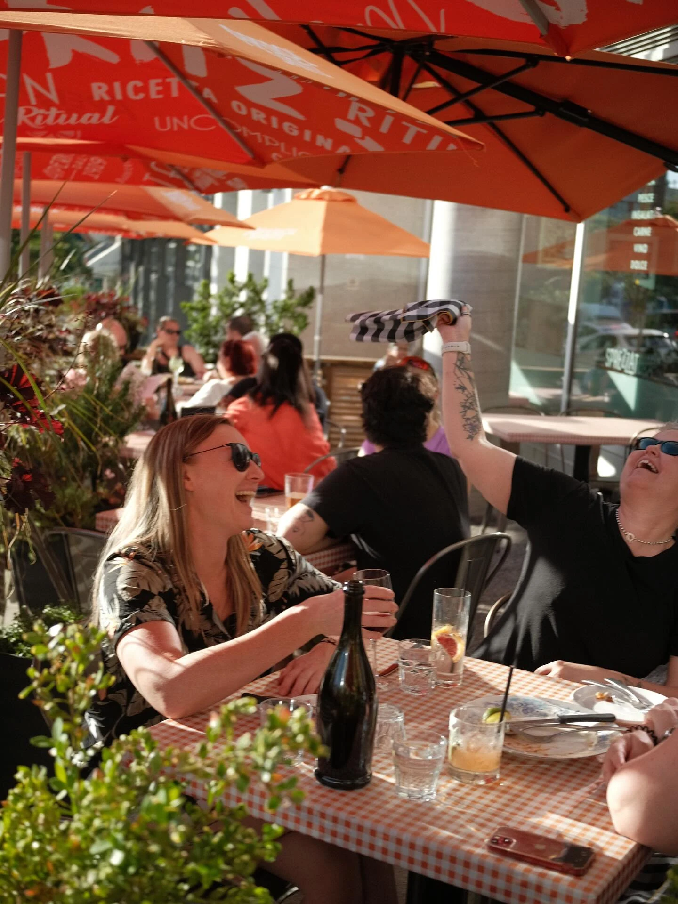
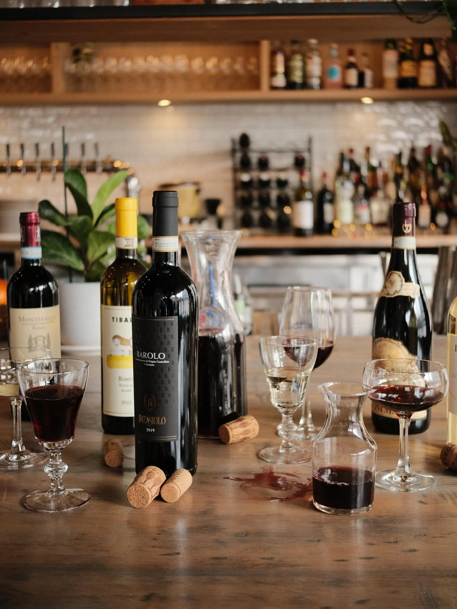
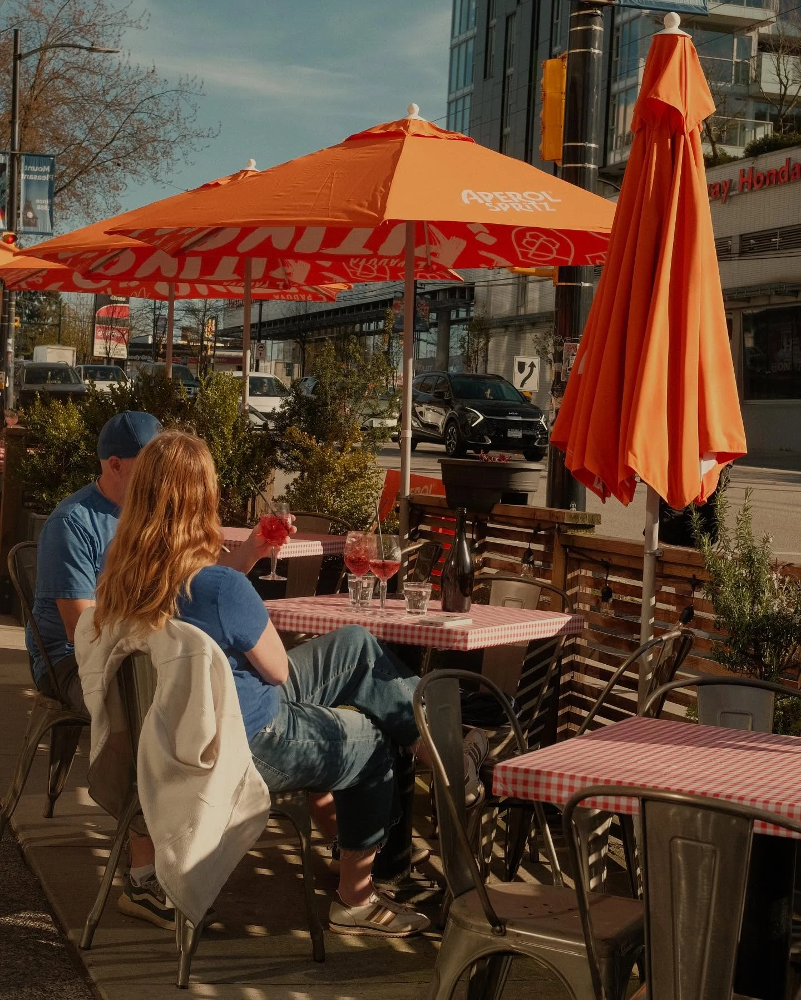

*Sprezzatura* is an old Italian word for a particular kind of showing off: the art of making something difficult look as though it cost you nothing. The restaurant on Kingsway that took the name defines it on its own website as “the art of effortless style. A balance of studied nonchalance and refined hospitality.”

That is a large thing to hang above a door. It also invites the obvious question, which is what exactly is being concealed.

Quite a lot, as it turns out. Sprezzatura opened in the summer of 2019 around a custom-built oven that runs to 900 degrees at the deck and a thousand in the dome, and a dough made with “00” flour and left to ferment for a hundred hours — the standard laid down by the Associazione Verace Pizza Napoletana. The oven’s mouth was made deliberately small, so the toppings stay moist while the base crisps. The pizzaiolo trained in Naples.

None of that reaches a table. That is the entire point of the word. Four days of fermentation arrive as a base thin enough to fold, blistered and charred at the rim, under a few folds of mortadella and a scatter of pistachios. The work is meant to be inaudible.

The room performs the same trick. Sophie Burke designed it, and it is full of decisions that do not announce themselves: dark teal walls hung with framed pictures and mirrors, green factory lamps brought from the Netherlands, a glass panel salvaged from Rockefeller Center and bought from an antiques dealer in Surrey. There is also a power outlet and a USB port at every seat, which is the least romantic detail in the building and possibly the most considered.

Kingsway is not the obvious address for any of this. The restaurant sits at East 11th, in the base of the Duke, and its patio looks across the traffic at a Honda dealership. Orange umbrellas, red gingham, rosemary in the planters, a Mount Pleasant banner on the lamp post. It is a determinedly unglamorous corner, and the room behaves as though it were not.

Pizza is only half of what the kitchen does. The other half is Italian roasts and braises, which is cooking whose hours are just as invisible by the time anything reaches a plate: short rib over polenta, the sauce dark enough to read as a full day’s reduction, a scatter of herbs on top and no explanation offered.

Seven years is a long time to keep up an act of not trying. Sprezzatura joined Bravo in July, alongside restaurants across Metro Vancouver.
